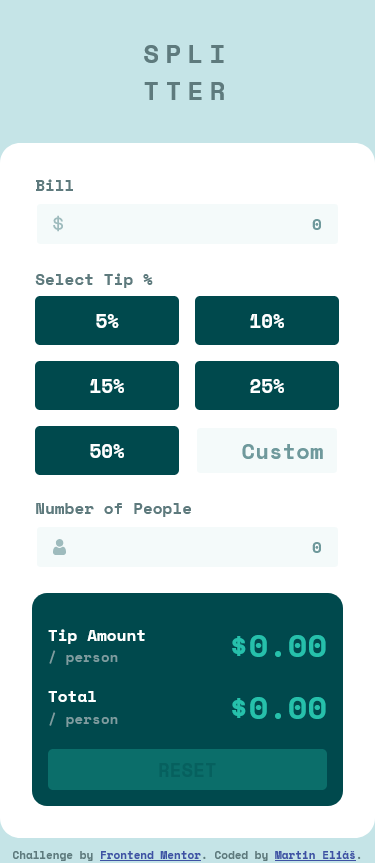
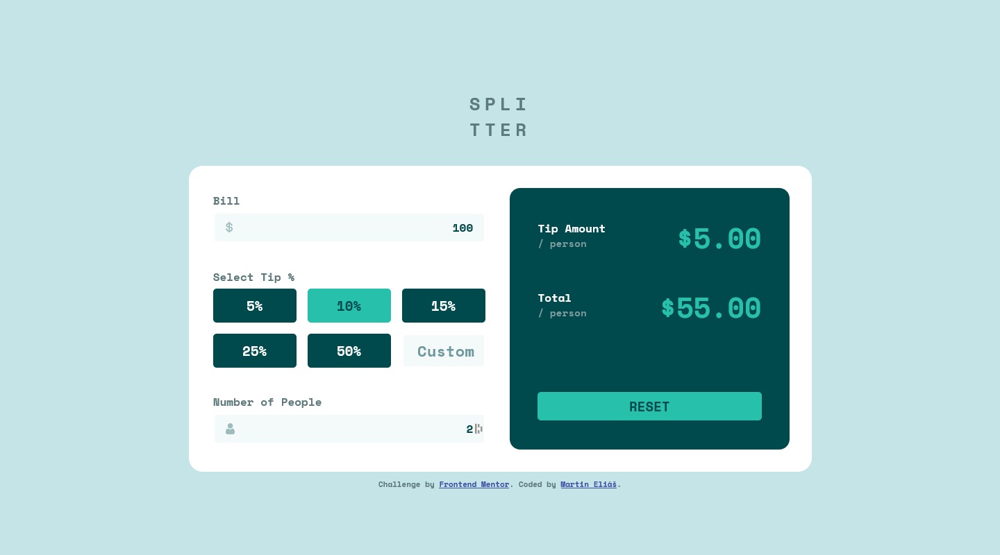

# Frontend Mentor - Tip calculator app solution

This is a solution to the [Tip calculator app challenge on Frontend Mentor](https://www.frontendmentor.io/challenges/tip-calculator-app-ugJNGbJUX). Frontend Mentor challenges help you improve your coding skills by building realistic projects.

## Table of contents

- [Overview](#overview)
  - [The challenge](#the-challenge)
  - [Screenshot](#screenshot)
  - [Links](#links)
- [My process](#my-process)
  - [Built with](#built-with)
  - [What I learned](#what-i-learned)
  - [Continued development](#continued-development)
- [Author](#author)

## Overview

### The challenge

Users should be able to:

- View the optimal layout for the app depending on their device's screen size
- See hover states for all interactive elements on the page
- Calculate the correct tip and total cost of the bill per person

### Screenshot

### Links

- Solution URL: [https://www.frontendmentor.io/solutions/tip-calculator-with-react-4Q5JBFo-pi](https://www.frontendmentor.io/solutions/tip-calculator-with-react-4Q5JBFo-pi)
- Live Site URL: [https://tip-calculator-app-main-ts.vercel.app/](https://tip-calculator-app-main-ts.vercel.app/)

## My process

### Built with

- Semantic HTML5 markup
- CSS custom properties
- Flexbox
- CSS Grid
- Mobile-first workflow
- [React](https://reactjs.org/) - JS library
- [SCSS](https://sass-lang.com/) - CSS extension
- [Create react app](https://create-react-app.dev/)

### What I learned

I struggled a bit with props sending from one component to another, and properly handling them. Forgot about top down data flow, so i have to fix it, that the parent component will handle state. After a long nights i finished this project successfully.
I have learned how to manage props, sending them from one component to another, top down data flow, onClick, onChange etc..

### Continued development

I´ll continue to become better working with React.

## Author

- Frontend Mentor - [@martinelias1312](https://www.frontendmentor.io/profile/martinelias1312)
- LinkedIn - [@MartinEliáš](https://www.linkedin.com/in/martin-eli%C3%A1%C5%A1-455550209/)
